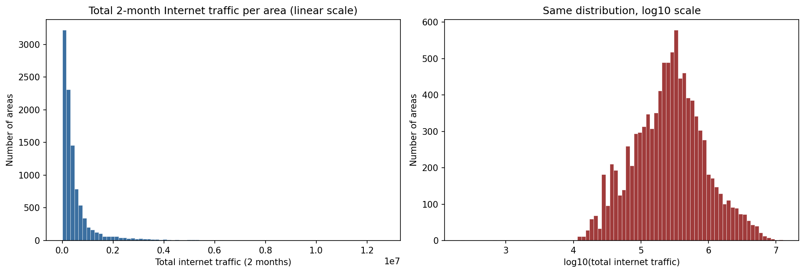
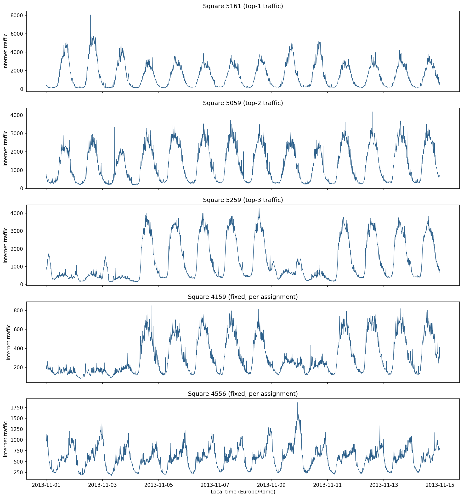
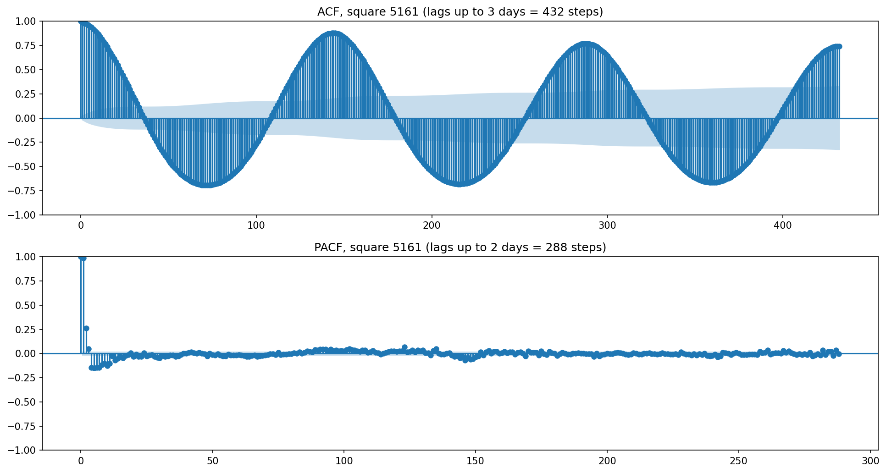
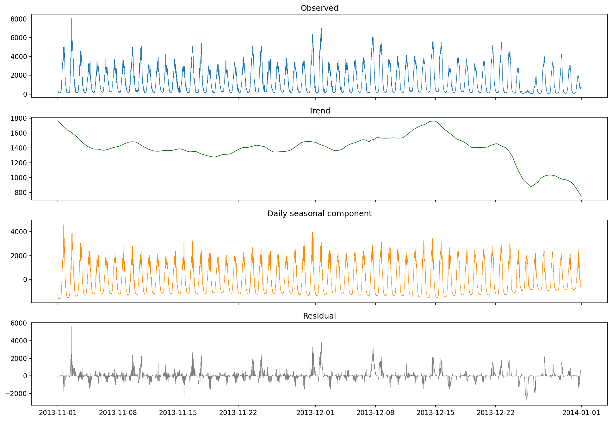
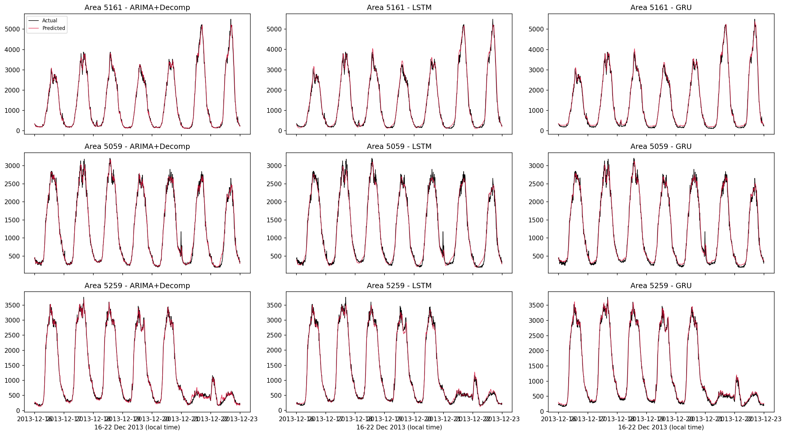
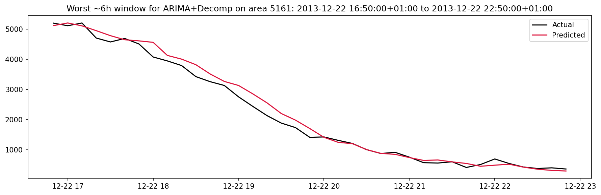

# Milan Mobile Network Traffic Forecasting

Formative assignment: comparative analysis of three sequential models (seasonal-decomposition + ARIMA,
LSTM, Transformer) for one-step-ahead mobile network traffic forecasting on the Milan telecom dataset.

## Files in this project

| File | What it is |
|---|---|
| `Milan_Traffic_Forecasting.ipynb` | The experiment notebook. Run this end-to-end in Google Colab. It downloads the dataset, runs the exploratory analysis, tunes and trains the three models, and saves every figure/table it produces. |
| `Report.md` | The write-up, structured as the required research report (Introduction, Related Work, Dataset and Data Preparation, Exploratory Analysis, Methodology, Results and Discussion, Conclusion, References). Convert to PDF for submission once finished. |
| `figures/` | Created by the notebook. Six PNG figures, referenced by both this README and `Report.md`. |
| `results/` | Created by the notebook. CSV/JSON files with every numeric result (memory-usage evidence, tuning logs, performance tables, timing, hardware info). |

## How to run

1. Open `Milan_Traffic_Forecasting.ipynb` in Google Colab.
2. `Runtime > Change runtime type > T4 GPU` (recommended, not required).
3. Run all cells top to bottom.
   - The first run downloads the full dataset (~19 GB, 61 daily files) from Harvard Dataverse and
     processes it with a bounded-memory streaming pipeline. Expect **30-90 minutes** depending on Colab's
     network throughput. The notebook handles Harvard Dataverse's Guestbook requirement automatically
     (a one-time signed-URL request per file, no manual action needed).
   - Google Drive mounts automatically (you'll get a one-time auth prompt). The processed cache, every
     figure, and every result table are written directly into
     `/content/drive/MyDrive/ML_technique_1/{cache,figures,results}`, so they persist across Colab
     sessions. The raw 19 GB dataset is kept on the local Colab disk only, not synced to Drive.
4. Everything you need is then already in your Drive folder - no manual download/copy step required.

## Finishing the report

`Report.md` has already been filled in with the real numbers from an actual run (top-3 areas, tuning
logs, performance tables, timing, hardware). What's left:

1. Copy your Drive `figures/` folder into this project directory, next to `Report.md` and this README
   (same relative path the images already use: `figures/fig1_traffic_distribution.png`, etc.) - every
   image placeholder below and in `Report.md` will then render automatically in any Markdown viewer.
2. A handful of `[...]` placeholders remain in `Report.md` where a cell's printed output wasn't captured
   (distribution skewness/zero-count, the STL seasonal-amplitude/residual numbers, the exact worst-error
   window) - each one names its source file in `results/`; open that file and fill it in.
3. Export `Report.md` to PDF for submission (e.g. a Markdown-to-PDF tool, or paste into Google Docs/Word
   and export).

## Results at a glance

**(real numbers from an actual Colab run)** Top-3 highest-traffic areas: **square 5161** (rank 1),
**square 5059** (rank 2), **square 5259** (rank 3).

| model | avg MAE | avg MAPE | avg RMSE | avg train time |
|---|---|---|---|---|
| Decomposition + ARIMA | **74.25** | **8.48%** | **105.87** | **3.3 s** |
| LSTM | 87.72 | 11.28% | 122.66 | 13.1 s |
| Transformer | 91.55 | 13.16% | 122.14 | 17.6 s |

The classical decomposition + ARIMA model won on every metric, on every area, and trained 4-5x faster
than the deep models - the opposite of what the cited literature (Section 2 of `Report.md`) predicted,
most likely because the ~38-day, single-area training set here is much smaller than what those studies
used. Full breakdown and discussion in `Report.md` Section 6.

## Data source

Telecom Italia "Big Data Challenge" Milan dataset (SMS-Call-Internet-MI): Barlacchi et al. (2015),
Harvard Dataverse `doi:10.7910/DVN/EGZHFV`.

## Preview: figures produced by the notebook

These placeholders point at the same `figures/` paths used in `Report.md` - once you copy the notebook's
output folder here, they render below as well.

*Figure 1 - traffic distribution across all 10,000 areas.*

*Figure 2 - two-week time series comparison.*

*Figure 3 - autocorrelation analysis.*

*Figure 4 - seasonal decomposition.*

*Figure 5 - actual vs. predicted traffic, all models and areas.*

*Figure 6 - failure-case window for the best-performing model.*
